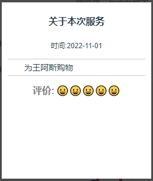

# SS
SS是一款专门为社会服务工作项目而创建的UI框架。

# 快速开始
`<link rel="stylesheet" href="/your path/ss.css">`


# 卡片


```
    <div class="ss-card">
        <h4 class="title">关于本次服务</h4>
        <span class="mark">时间:2022-11-01</span>
        <div class="content">为王阿斯购物</div>
        <div class="evaluation"><span>评价:</span>😀😀😀😀😀</div>
    </div>
```

